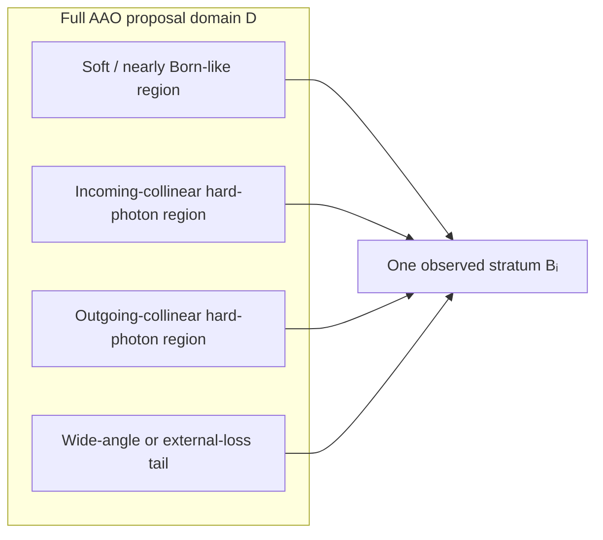
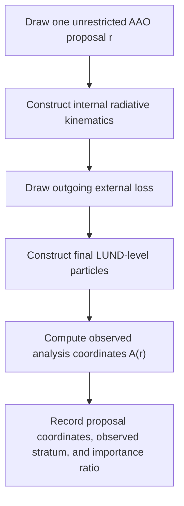
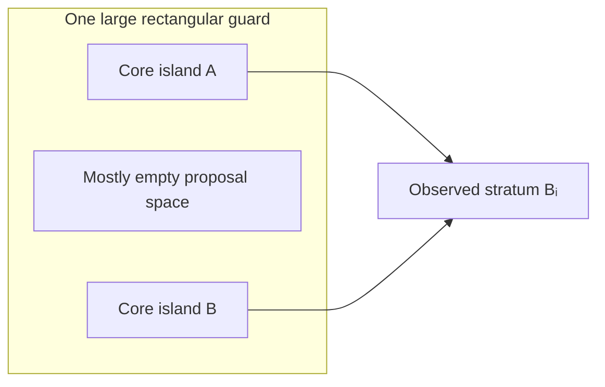
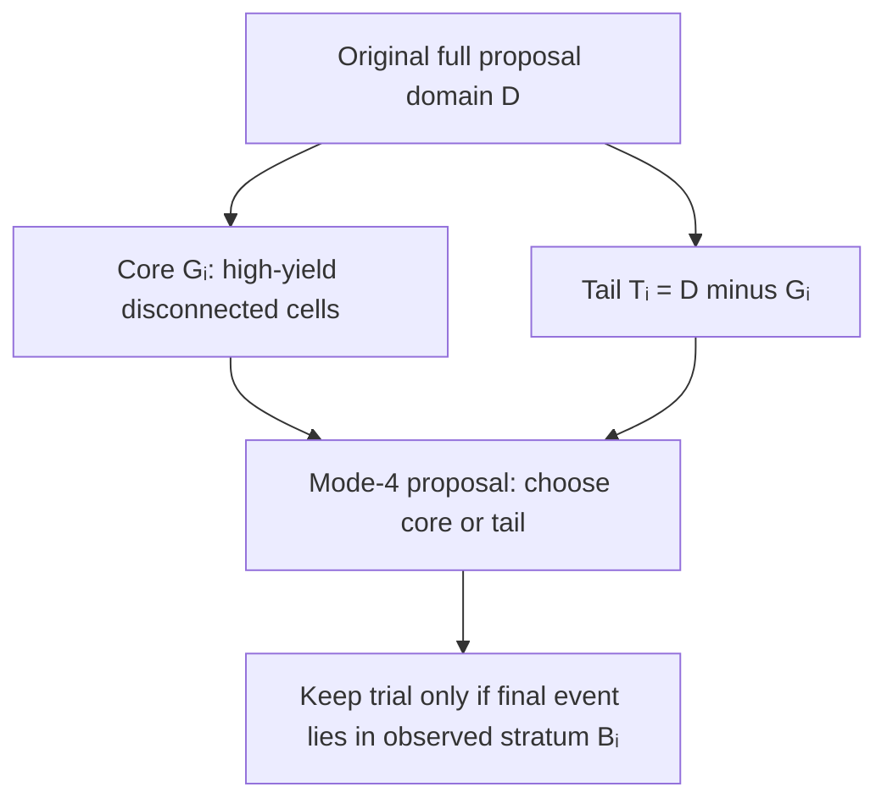
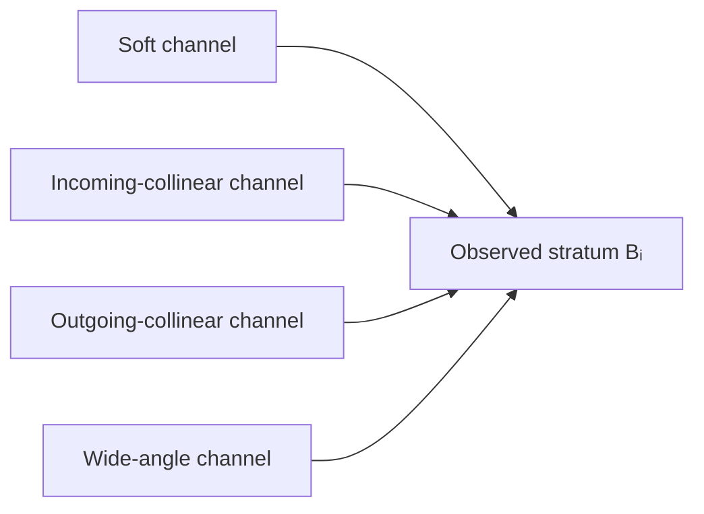
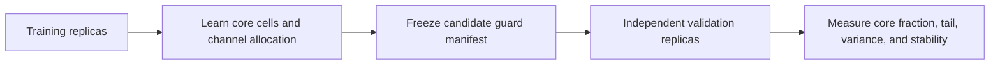
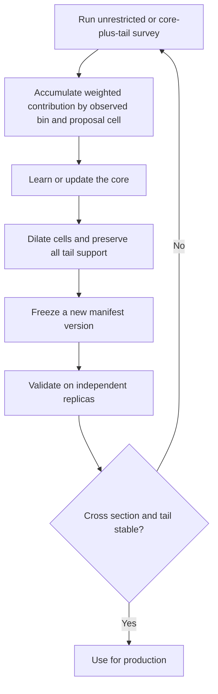
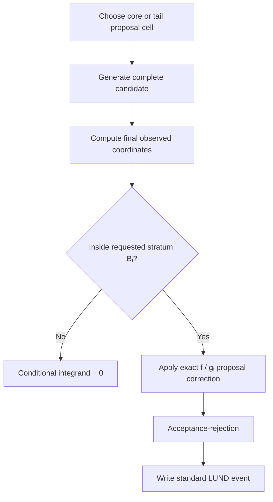
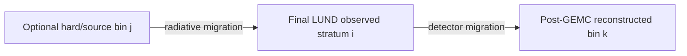
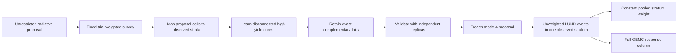

# A Pedagogical Guide to Guard Proposals for Bin-Conditional AAO Radiation

## Purpose

> **Renderer note:** This guide deliberately uses Unicode and plain-text equations instead of LaTeX so that every formula remains readable in the Codex Markdown preview and in terminals.

This guide explains how to discover and validate an efficient Monte Carlo
proposal for each **observed analysis stratum** in a future bin-conditional
mode of `aao_rad`.

The intended analysis coordinates are

```text
(Q²_obs, xB_obs, −t_obs, φ_obs)
```

computed from the final generator particles in the same way as the analysis:

- `Q²_obs` and `xB_obs` use the nominal beam and the final
  LUND electron;
- `−t_obs` uses the final LUND proton;
- `φ_obs` uses the analysis Trento convention;
- optional `W` and `y` restrictions use the same observed-coordinate
  definitions.

The central problem is that AAO does not directly sample these final
coordinates. It samples a collection of electron, photon, hadronic-decay, and
external-radiation variables. Many different combinations of those proposal
variables can produce an event in the same observed analysis bin.

The goal is therefore to answer:

> Which regions of AAO's proposal space contribute appreciable physical cross
> section to each observed analysis stratum, and how can we emphasize those
> regions without accidentally deleting real contributions?

The short answer is:

1. survey the full proposal space;
2. measure contributions using cross-section weights, not raw event counts;
3. learn a high-yield **core** for every observed stratum;
4. retain a nonzero **tail** proposal over the rest of the original domain;
5. validate the learned core on independent replicas;
6. unweight with the exact density of the combined core-plus-tail proposal.

The rest of this guide develops that answer carefully.

---

## 0. The mental model: two spaces and a many-to-one map

There are two spaces that must not be confused.

### Proposal space

This is the space in which AAO draws random numbers. A proposal point contains
quantities such as:

```text
1/Q²_l,  E′,  Eγ,  Ωγ,  cos θ*π,  φ*π
```

together with incoming and outgoing external-radiation draws.

Call a complete proposal point `r`.

### Observed analysis space

After AAO constructs the final LUND particles, the analysis computes

```text
A(r) = (Q²_obs, xB_obs, −t_obs, φ_obs)
```

An observed stratum `B_i` is one four-dimensional analysis bin.

### The map is many-to-one

Several disconnected regions of proposal space can map into the same observed
stratum:



This is the reason a guard cannot safely be inferred from only one marginal
minimum and maximum. The contributing region may contain several separate
"islands."

### One sentence to remember

> The observed bin tells us where the completed event ends; the proposal point
> tells us how AAO found its way there.

---

## Terminology

| Term | Meaning |
|---|---|
| Proposal point `r` | One complete set of AAO random choices before acceptance-rejection |
| Proposal density `g(r)` | Probability density with which AAO proposes `r` |
| Physical integrand `f(r)` | Differential radiative cross-section density represented at `r` |
| Importance ratio `R(r)` | `f(r)/g(r)`, including the required Jacobians and proposal corrections |
| Observed map `A(r)` | Final `(Q², xB, −t, φ)` computed from the completed LUND-level event |
| Observed stratum `B_i` | One requested analysis bin |
| Proposal cell `C_c` | A small region of proposal space used for survey summaries and steering |
| Core guard `G_i` | High-yield proposal cells for observed stratum `i` |
| Tail `T_i` | The remainder `D ∖ G_i` of the original proposal domain |
| Replica | An independent survey or production run with the same settings and a different seed |
| Hard/source bin | Optional bin derived from hadronic-transfer coordinates; not the observed stratum |
| Reconstructed bin | The bin assigned after GEMC and reconstruction |

The word **guard** in this guide means an efficiency proposal. It must not
silently become a physics cut.

---

# The eleven-point workflow

## 1. Define proposal space explicitly

### Why this comes first

Before learning a guard, we must know exactly what AAO samples and what density
it uses. Otherwise, changing the sampling range can change the physics
normalization without our noticing.

The most useful representation is AAO's underlying normalized random
coordinates rather than only the transformed physical quantities.

For example:

```text
r_u = (u_l − u_l,min) / (u_l,max − u_l,min),    u_l = 1/Q²_l
```

and

```text
r_E′ = (E′_max − E′) / (E′_max − E′_min)
```

Both lie in `[0, 1]` under the legacy proposal.

AAO samples the photon energy through

```text
u_γ = exp(−k_exp Eγ),    Eγ = −ln(u_γ) / k_exp
```

so `u_γ`, not `Eγ`, is the natural base proposal coordinate.

### Recommended first proposal coordinates

| Base coordinate | Physical interpretation | Initial guard treatment |
|---|---|---|
| `r_u` | Leptonic `1/Q²_l` | Partition |
| `r_E′` | Pre-outgoing-loss electron energy | Partition |
| `u_γ` | Transformed internal-photon energy | Partition |
| `intreg` | Soft/photon-angle importance channel | Keep separate |
| `r_cosθ*` | Hadronic decay polar angle | Partition |
| `r_φ*` | Hadronic decay azimuth | Partition periodically |
| Photon-angle local randoms | Location within `intreg` | Initially leave unrestricted |
| Incoming external-loss draw | Energy entering the interaction | Initially leave unrestricted |
| Outgoing external-loss draw | Energy of final LUND electron | Initially leave unrestricted |

Leaving a variable unrestricted does not mean it is unimportant. It means the
first guard version does not truncate or steer it.

### Why base coordinates are valuable

If a proposal cell occupies volume `V_c` in a unit cube and AAO samples
uniformly inside it, its normalized density is known:

```text
g_c(r) = 1/V_c,    for r ∈ C_c
```

That makes the later proposal correction exact. A visually convenient box in
transformed physical coordinates is not necessarily uniform and may have a
nontrivial normalization.

### Deliverable from point 1

A written proposal specification containing:

- every sampled variable;
- its global limits;
- its probability density or base-coordinate mapping;
- all discrete channel probabilities;
- every Jacobian already included in AAO's integrand.

No learned guard should be used before this specification exists.

---

## 2. Add a fixed-trial radiative survey

### What the survey does

The survey explores the original, unrestricted radiative proposal. For every
proposal trial, it constructs enough of the event to determine:

1. where the trial was proposed;
2. how much cross section the trial represents;
3. which observed stratum receives the final event.



### Why outgoing external loss must happen before classification

The observed electron uses the post-external-loss energy. Therefore, a trial's
observed `Q²` and `xB` cannot be known until that loss has been sampled.

Legacy `aao_rad` currently makes its internal acceptance decision first and
samples outgoing external loss later. That ordering is adequate for its
existing output algorithm, but it is insufficient for a weighted survey of
final observed strata.

The future survey path should construct a complete candidate before assigning
the observed stratum. The legacy path should remain available during
validation.

### Why use a fixed number of trials

Suppose a run stops as soon as it emits 10,000 events. The number of proposal
trials is then a random variable correlated with the accepted events. This is
convenient for production, but less clean for estimating which proposal cells
carry cross section.

A survey should instead specify:

```text
run exactly Ntrial proposals
```

and estimate integrals from all those trials.

### What should be recorded

For each physically constructible trial:

```text
replica and trial index
base proposal coordinates
physical proposal coordinates
soft/resolved branch and intreg
incoming, pre-outgoing-loss, and final electron energies
internal-photon four-vector or energy and angles
hadronic-transfer coordinates
final LUND electron and proton four-vectors
observed Q2, xB, -t, phi, W, and y
observed stratum ID
importance ratio
validity/rejection status
```

For large surveys, the final implementation may aggregate these quantities
online or write a compact binary format. The schema matters more than the text
format.

### Accepted events alone are not enough

An already-unweighted global LUND sample can reveal the dominant physical
regions, but it discards most proposal information. Rare observed bins are
precisely the bins for which accepted-event diagnostics are weakest.

The fixed-trial survey retains the proposal-level information needed to improve
those bins.

---

## 3. Measure weighted contributions, not raw trial counts

### The importance ratio

Let `f(r)` denote the physical radiative integrand and `g(r)` the proposal
density. Define

```text
R(r) = f(r) / g(r)
```

For observed stratum `B_i`,

```text
R_i(r) = R(r) · 1[A(r) ∈ B_i]
```

The stratum cross section is

```text
Σ_i = ∫ R_i(r) g(r) dr = E_g[R_i(r)]
```

Its survey estimator is

```text
Σ̂_i = (1/N_trial) ∑[n=1…N_trial] R_i(r_n)
```

including the fixed phase-volume factor defined by the implementation.

### Why counts can be misleading

Imagine two proposal cells contributing to the same observed bin:

| Cell | Trials reaching the bin | Importance ratio per trial | Total survey contribution |
|---|---:|---:|---:|
| A | 100 | 1 | 100 |
| B | 2 | 100 | 200 |

Cell A has 50 times more contributing trials, but cell B carries twice as much
estimated cross section.

A guard learned from counts would emphasize A and might discard B. A guard
learned from weighted contribution recognizes that B is essential.

### Per-cell summaries

For proposal cell `C_c`, accumulate:

```text
S_ic = ∑[n: r_n ∈ C_c] R_i(r_n)
```

```text
S²_ic = ∑[n: r_n ∈ C_c] R_i(r_n)²
```

and

```text
M_ic = max[n: r_n ∈ C_c] R_i(r_n)
```

These answer three different questions:

- `S_ic`: how much cross section appears to come from this cell?
- `S²_ic`: how much Monte Carlo variance comes from this cell?
- `M_ic`: how difficult could this cell be to unweight?

Also record the effective sample size

```text
N_eff = (∑_n R_i(r_n))² / ∑_n R_i(r_n)²
```

A large raw count with a small `N_eff` is not a precise survey.

---

## 4. Represent disconnected contributing regions

### The failure of one bounding box

Suppose an observed stratum receives contributions from two compact islands:

- a soft/Born-like island;
- a hard-photon feed-in island.

A single rectangle enclosing both islands also encloses the empty space between
them:



This is inefficient because AAO spends trials in the empty middle. Worse, if
the rectangle is chosen from marginal quantiles, a small but important third
island can lie completely outside it.

### Use a union of cells

Partition selected base proposal variables into a grid. Define the core as a
set of occupied, high-contribution cells:

```text
G_i = ⋃[c ∈ 𝒞_i] C_c
```

The cells do not need to touch.

Conceptually:

```text
u_gamma
   ^
   |  .  .  A  A  .  .  .  .
   |  .  .  A  A  .  .  .  .
   |  .  .  .  .  .  B  B  .
   |  .  .  .  .  .  B  B  .
   |  .  .  .  .  .  .  .  .
   +----------------------------> 1 / Q_l^2

      A and B are disconnected proposal cells that feed the same observed bin.
      Dots remain part of the full proposal tail.
```

### Constructing an initial core

Rank proposal cells by `S_ic`. Add cells until the retained estimated
fraction reaches a target:

```text
ρ̂_i = (∑[c ∈ G_i] S_ic) / (∑_c S_ic)  ≥  1 − τ_learn
```

Then dilate the selected set by at least one neighboring grid cell in each
partitioned dimension.

Dilation protects against:

- finite pilot fluctuations;
- sharp cell boundaries;
- small shifts between replicas;
- periodic wraparound in `φ`.

For angular variables, neighborhood expansion must wrap across `0` and
`2π`.

### What this core means

It means:

> The pilot suggests that these cells are efficient places to look for events
> ending in observed stratum `i`.

It does **not** mean:

> Physics outside these cells is zero.

That distinction motivates point 5.

---

## 5. Preserve full support with disjoint core and tail

### Why a finite pilot cannot certify a hard guard

If no pilot event from region `U` reaches observed stratum `i`, there are at
least two possibilities:

1. the true contribution from `U` is zero;
2. the contribution is nonzero but too rare to appear in the pilot.

No finite survey can distinguish these with absolute certainty.

A hard guard that assigns zero proposal probability to `U` would turn the
second case into an undetectable bias.

### The safe construction

Let `D` be the original global proposal domain. Define:

```text
G_i = learned high-yield core
```

```text
T_i = D ∖ G_i
```

The regions are disjoint and exhaustive:

```text
G_i ∩ T_i = ∅,    G_i ∪ T_i = D
```



The word **tail** includes every original proposal point not in the learned
core. It is not merely a thin geometric border.

### The proposal mixture

Choose the core with probability `α_i` and the tail with probability
`1 − α_i`:

```text
g_i(r) = α_i g_Gi(r) + (1 − α_i) g_Ti(r)
```

Typical starting values might place `95%–99.5%` of trials in the core, but
the value should be learned from efficiency and variance measurements.

Because the regions are disjoint, the active proposal density is unambiguous:

```text
g_i(r) = { α_i g_Gi(r)          when r ∈ G_i
         { (1 − α_i) g_Ti(r)    when r ∈ T_i
```

### Cell-level form

If cell `C_c` has base-coordinate volume `V_c`, is selected with probability
`α_ic`, and is sampled uniformly, then

```text
g_i(r) = α_ic / V_c,    for r ∈ C_c
```

The corrected importance ratio becomes

```text
R_new,i(r) = R_base(r) · (V_c/α_ic) · 1[A(r) ∈ B_i]
```

This correction is what allows proposal steering without changing the physical
distribution.

### The most important conceptual picture

```text
The core is a fast lane.
The tail is a safety lane.
Together they still cover the original road.
```

If the core is imperfect, the run becomes less efficient. It does not become
biased, provided the tail remains nonzero and the proposal density is handled
exactly.

---

## 6. Keep radiation channels separate

### Why there are several channels

The radiative integrand has qualitatively different enhanced regions:

- unresolved soft radiation;
- photons close to the incoming electron;
- photons close to the outgoing electron;
- transition regions around those peaks;
- wide-angle photons.

AAO already treats these through its `intreg` importance regions.

These channels can map differently into the same observed stratum:



The labels "incoming-collinear" and "outgoing-collinear" describe importance
regions, not a unique event-by-event ISR/FSR history. The physical cross section
still includes interference.

### Channel fractions

For channel `a`, estimate:

```text
Σ_ia = ∫[channel a] R_i(r) g(r) dr
```

and

```text
F_ia = Σ_ia / Σ_i
```

These fractions help allocate proposal effort.

### Never disable an unseen channel

If one training replica finds zero wide-angle events in a bin, that is not proof
that the wide-angle contribution vanishes.

Every channel should retain either:

- a nonzero direct allocation; or
- coverage through the global tail component.

A small probability floor is a statistical safety feature.

### Why channel separation improves learning

Without channel labels, a guard learner may try to enclose incompatible regions
with one large cell set. Channel separation lets each mechanism have an
appropriate local proposal while the final mixture remains exact.

---

## 7. Train and validate on independent replicas

### What a replica is here

A replica uses:

- the same beam energy;
- the same physics model;
- the same global proposal limits;
- the same target and radiation settings;
- a different independent random seed.

The physical settings do not differ. The random Monte Carlo realization does.

### Why independent validation is necessary

If a core is learned and evaluated on the same finite sample, it will appear
better than it really is. The learner has selected the cells that happened to
perform well in that sample.

Use separate roles:



### Quantities to report

For each observed stratum:

```text
Σ̂_i,G,   Σ̂_i,T,   and   Σ̂_i = Σ̂_i,G + Σ̂_i,T
```

Define:

```text
ρ̂_i = Σ̂_i,G / Σ̂_i,    τ̂_i = Σ̂_i,T / Σ̂_i
```

Also report:

- standard errors;
- effective sample sizes;
- channel fractions;
- proposal yield per trial;
- largest corrected importance ratio;
- cells responsible for most tail contribution;
- stability after one-cell dilation.

### What success looks like

A good core has:

- high `ρ_i`;
- a measurable, controlled tail;
- no isolated tail cell dominating the variance;
- similar performance across independent replicas;
- stable `Σ_i` under guard expansion.

The exact numerical threshold should be set relative to the desired uncertainty
on acceptance and `C_rad`, not chosen only because a round number looks
small.

---

## 8. Iterate the guard

Guard discovery is an iterative measurement, not a one-time bounding-box
calculation.



### One iteration

For observed stratum `i`:

1. estimate cell contributions;
2. identify important cells currently in the tail;
3. add those cells and their neighbors to the core;
4. update channel allocations;
5. freeze a new proposal;
6. validate with fresh replicas.

### Suggested stopping logic

Stop expanding when all of the following hold:

1. `Σ̂_i` is stable within its statistical uncertainty;
2. independent replicas agree;
3. one further guard dilation does not materially change `Σ̂_i`;
4. tail cells do not dominate the variance;
5. mode-4 proposal efficiency is adequate for the production goal.

Because the tail remains active, stopping is an efficiency decision rather than
a declaration that omitted physics is zero.

### Neighbor borrowing

For very sparse observed bins, it can be useful to seed the first core from:

- adjacent `Q²` and `xB` strata;
- adjacent `−t` strata;
- periodically adjacent `φ` strata;
- the corresponding Born mapping expanded for radiation.

Borrowing supplies a starting proposal. It does not replace independent
radiative validation.

---

## 9. Freeze and version every production proposal

### Why adaptation during production is dangerous

The event correction depends on the proposal density:

```text
R_i(r) = [f(r)/g_i(r)] · 1[A(r) ∈ B_i]
```

If `g_i` changes without being recorded, the correct weight changes too.

Therefore, a production replica should use one frozen proposal manifest.
Learning can occur between replicas or campaign iterations, not silently inside
a run.

### Minimum guard-manifest content

```json
{
  "schema": "aao-rad-guard-v1",
  "observed_stratum_id": "s01440",
  "coordinate_definition": "final_lund_analysis",
  "analysis_config_sha256": "...",
  "generator_revision": "...",
  "global_proposal_domain": {},
  "partition_definition": {},
  "core_cells": [],
  "tail_definition": "global_domain_minus_core_cells",
  "cell_probabilities": [],
  "radiative_channel_probabilities": {},
  "training_replica_ids": [],
  "validation_replica_ids": [],
  "guard_iteration": 0,
  "estimated_core_fraction": 0.0,
  "estimated_tail_fraction": 0.0
}
```

The manifest should also record:

- target and external-radiation settings;
- `Eγ = δ` boundary;
- optional `W/y` conditioning;
- base-coordinate transforms;
- proposal probability floors;
- envelope safety factors;
- survey software revision.

### Provenance

Every production `.norm`, completed-run record, and campaign manifest should
include the guard-manifest hash.

The LUND structure itself does not need to change.

---

## 10. Produce bin-conditional unweighted events

### Target density

For observed stratum `B_i`, the desired physical density is:

```text
p_i(r) = f(r) · 1[A(r) ∈ B_i] / Σ_i
```

### Production algorithm

For each trial:

1. choose a proposal cell/channel according to the frozen manifest;
2. sample the base variables inside that cell;
3. construct the complete internal-radiative event;
4. sample outgoing external loss;
5. construct the final LUND-level event;
6. compute the final observed coordinates;
7. set the trial importance ratio to zero if it is outside `B_i`;
8. otherwise apply the exact cell/channel proposal correction;
9. perform acceptance-rejection;
10. write an ordinary LUND event if accepted.



### Why the accepted distribution is correct

Let `g_i(r)` be the learned core-plus-tail proposal and define:

```text
R_i(r) = [f(r)/g_i(r)] · 1[A(r) ∈ B_i]
```

If `M_i` is an envelope and the acceptance probability is

```text
P_accept(r) = R_i(r) / M_i
```

then the accepted density is proportional to

```text
g_i(r) P_accept(r) = (1/M_i) f(r) · 1[A(r) ∈ B_i]
```

The learned proposal cancels. It changes efficiency, not physics.

### Envelope overshoots

Finite pilots cannot guarantee that `M_i` exceeds every future importance
ratio. The implementation should retain AAO's stochastic multiplicity
correction for overshoots and report:

- `mcall_max`;
- number and fraction of overshoot trials;
- largest `R_i/M_i`;
- duplicate-event contribution to effective statistics.

The desired production state is still a conservative envelope with nearly all
events satisfying `mcall <= 1`.

### Stratum normalization

The integrated observed-stratum cross section is estimated from all proposal
trials:

```text
Σ̂_i = (1/N_trial) ∑_n R_i(r_n)
```

After pooling replicas, every emitted event in stratum `i` receives:

```text
w_i = Σ̂_i / N_i
```

Events are globally nonuniform across strata by design, but they are physically
distributed within each stratum and have one constant stratum weight.

---

## 11. Require closure before production use

No guard should be trusted solely because it increases proposal efficiency.

### A. Coordinate parity

For the same final particles, the generator and Python analysis must agree on:

```text
Q²_obs,  xB_obs,  −t_obs,  φ_obs,  W_obs,  y_obs
```

They must also agree on bin-edge conventions and periodic `φ`.

### B. Global cross-section closure

For a complete observed partition:

```text
∑_i Σ̂_i + Σ̂_outside ≃ Σ̂_global
```

The outside category is necessary because the requested analysis bins may not
cover the full global proposal output.

### C. Guard closure

For every adequately populated observed stratum:

```text
Σ̂_i,core+tail ≃ Σ̂_i,unrestricted
```

This should be checked with independent seeds.

### D. Weighted shape closure

Pool all mode-4 strata using their stratum weights. Compare against an
unrestricted global radiative sample in:

- observed `Q², xB, −t, φ`;
- `Eγ` and photon angles;
- soft/resolved fraction;
- `Q²_h, W_h`, and other hard coordinates;
- incoming and outgoing external energy losses.

Agreement only in the four observed coordinates is insufficient. A mistaken
guard could reproduce those coordinates while distorting hidden radiation
variables relevant to detector response.

### E. Channel closure

Repeat normalization and shape comparisons separately for:

- soft events;
- every resolved-photon `intreg` channel.

### F. Replica closure

Independent replicas must produce statistically compatible:

- `Σ_i`;
- core/tail fractions;
- channel fractions;
- efficiency;
- maximum-weight behavior.

### G. Guard-expansion stability

Expand every core by one cell and rerun a subset of strata. The physical
cross-section result should remain stable even if efficiency changes.

### H. Full migration bookkeeping

Each event may carry three distinct bin labels:



Mode 4 conditions on `i`, not `j` or `k`.

- All hard/source regions capable of feeding `i` must remain supported.
- GEMC remains free to migrate the event from `i` to any reconstructed bin
  `k`.

---

# What the guard does—and does not—guarantee

## Guaranteed when implemented correctly

- The full original proposal domain remains supported.
- Proposal steering is corrected by the exact `f/g_i` ratio.
- Accepted events follow the physical radiative density conditional on the
  observed stratum.
- Each observed stratum has a well-defined integrated cross section.
- Proposal inefficiency cannot silently remove a tail contribution.

## Learned empirically

- Which proposal cells form an efficient core.
- How much probability to allocate to core and tail.
- How much probability to allocate to each radiative channel.
- The unweighting envelope.
- The predicted event yield per proposal.

Empirical quantities require independent validation and may improve as more
survey data become available.

---

# Common confusions

## “If the core captures 99.9%, why retain the tail?”

Because 99.9% is an estimate from a finite sample. More importantly, a small
tail can matter when the goal is sub-percent precision or when the tail has
large weights.

The tail converts a possible bias into a measurable statistical contribution.

## “Does the tail destroy the efficiency gain?”

Not if its proposal probability is small and chosen sensibly. Most trials come
from the high-yield core. The tail consumes a controlled fraction of the
proposal budget while protecting full support.

## “Why not learn a guard from accepted LUND events?”

Accepted events show the physical distribution, but they omit rejected
proposal points and are sparse in precisely the low-yield bins that need
improvement. A proposal-level weighted survey is more informative.

## “Why not use the observed minimum and maximum of each variable?”

Marginal extrema ignore correlations and disconnected islands. They are also
unstable under finite statistics.

## “Does conditioning on the observed bin remove detector migration?”

No. The condition is applied before GEMC. The event is generated in observed
truth stratum `i`, but reconstruction can place it in any bin `k`.

## “Does conditioning on the observed bin remove radiative feed-in?”

No—provided the underlying proposal remains globally supported. Different
hard/source configurations `j` may all feed observed stratum `i`.

## “Can we eventually eliminate the global tail?”

Only if an analytic argument proves that the excluded proposal region has
exactly zero support for the observed bin. Empirical non-observation alone is
not sufficient.

---

# Recommended implementation milestones

## Milestone 1: candidate construction and survey output

- Refactor the radiative candidate construction so final observed coordinates
  exist before mode-4 classification.
- Preserve a legacy execution path for comparison.
- Add deterministic fixed-trial survey runs.
- Record proposal, hard, final, and weight information.

Implemented on this development branch:

- radiative run-control mode `0` retains legacy unweighted generation;
- diagnostic mode `1` runs the unrestricted fixed-trial survey;
- `build_final_candidate` is shared by the legacy and survey paths;
- `aao-rad-survey-v1` records proposal, hard, final-particle, observed, and
  cross-section fields;
- `radiative_survey.py` runs surveys and independently validates their
  normalization and final-particle coordinate parity.

See `RADIATIVE_SURVEY.md` for commands and exact output semantics. Mode `4`
remains reserved for the later bin-conditional production implementation.

## Milestone 2: Python guard learner

Add a workflow with conceptual commands such as:

```text
prepare-survey
run-survey
learn-guards
validate-guards
summarize-coverage
```

The learner should:

- use the analysis binning configuration directly;
- aggregate weighted cell contributions;
- treat `φ` periodically;
- separate radiative channels;
- dilate learned cells;
- write immutable guard manifests.

Implemented on this development branch:

- `radiative_guards.py learn-guards` streams and pools independent training
  surveys using the configured observed-coordinate bins and cuts;
- weighted cell summaries keep `intreg` separate and use periodic angular
  dilation;
- the immutable `aao-rad-guard-v1` manifest represents each disconnected core
  compactly as seed cells plus axis dilation, while defining the tail as the
  complete global complement with nonzero proposal probability;
- `validate-guards` refuses training/validation replica overlap and measures
  core, tail, channel, ESS, largest-tail-cell, and extra-dilation behavior on
  held-out surveys;
- `summarize-coverage` provides a compact campaign-level report.

See `RADIATIVE_SURVEY.md` for executable commands. Manifests intentionally set
`production_ready` to false until milestone 3 implements the exact proposal
correction and radiative unweighting.

## Milestone 2b: hard-parent migration diagnostic

The independent proposal-cell learner is a general baseline, but it does not
share the Born-like structure of neighboring radiative strata.
`radiative_migrations.py` therefore builds a complementary
cross-section-weighted mapping from

```text
(Q2_hard, xB_hard, minus_t_hard, phi_cm, intreg)
```

to each final-LUND analysis stratum. Hard coordinates use the analysis edges
plus explicit nonperiodic underflow and overflow parents, so generator-level
radiative feed-in remains visible. Training selects compact parent/channel
footprints; independent replicas measure their completeness, cross-section
purity, extra-dilation recovery, and stability.

The migration matrix is diagnostic and `production_ready` remains false. It
does not assume that the radiative integrand can already be sampled in hard
coordinates. See `RADIATIVE_MIGRATIONS.md` for commands and artifacts.

## Milestone 3: core-plus-tail radiative mode 4

- Read a frozen guard table prepared from the manifest.
- Sample proposal cells with recorded probabilities.
- evaluate the exact new importance ratio;
- condition on final observed coordinates;
- retain stochastic multiplicity protection;
- write unchanged LUND and enriched sidecars.

## Milestone 4: campaign integration

Reuse the existing Born infrastructure for:

- canonical stratum and replica identifiers;
- independent seeds;
- pooled cross sections;
- constant stratum weights;
- OSG type-2 chunk provenance;
- downstream event weights.

Add the guard-manifest hash and radiative survey provenance.

## Milestone 5: physics and detector closure

- Validate against unrestricted radiative AAO.
- Run selected strata through GEMC.
- confirm complete truth-to-reconstruction response columns;
- expand proposal support and final-coordinate guard strata until the relevant
  corrections are stable.

---

# A compact checklist

Before accepting a guard proposal for observed stratum `i`, verify:

- [ ] The observed coordinate definition exactly matches the analysis.
- [ ] The global proposal domain is recorded and unchanged.
- [ ] Survey runs use fixed proposal counts and independent seeds.
- [ ] Cell importance is measured with cross-section weights, not counts.
- [ ] Disconnected proposal islands are representable.
- [ ] The core is dilated beyond the cells selected by training data.
- [ ] The complement of the core retains nonzero proposal probability.
- [ ] Soft and resolved-photon channels retain support.
- [ ] The proposal is frozen and hashed for each production replica.
- [ ] Core-plus-tail normalization agrees with the unrestricted proposal.
- [ ] Weighted hidden-variable shapes close, not only the four observed axes.
- [ ] Guard expansion leaves the physical result stable.
- [ ] Envelope overshoots and `mcall` behavior are reported.
- [ ] The resulting LUND remains standard and unchanged.

---

# Final picture



The durable principle is:

> Learn where to spend proposals, but never confuse “rare in the pilot” with
> “physically impossible.” A core-plus-tail proposal gives efficiency and
> correctness at the same time.
